# Threat Intel & T-Pot Manual

## ImportantDetails Folder

Once the setup is complete, a folder named `IMPORTANTDETAILS` is created within the project folder.

This folder contains two files: 
- `IMPORTANTCREDENTIALSANDURLDETAILS.txt`, which includes the Kibana URL and its username, password, and Threat Intel dashboard details.
- `tpotip.txt`, which contains the IP address of the VM.

## Accessing the Threat Intel Dashboard

The Honeypot is integrated with the Threat Intel API Service. Samples received in the honeypot are analyzed using the Threat Intel Service to categorize the verdicts. To enable this service, a license key is required.

You can obtain a free Threat Intel license key from the CySecurity page.

> **Note: The free license key will have a limit of 1000 hash checks and 100 file uploads per day.**

### Obtain Free License Key

- Open your web browser and enter the following address: <https://cysecurity.co/panel/keys/request>.

- This will take you to the license request page, where you can provide your email address to receive an activation link.

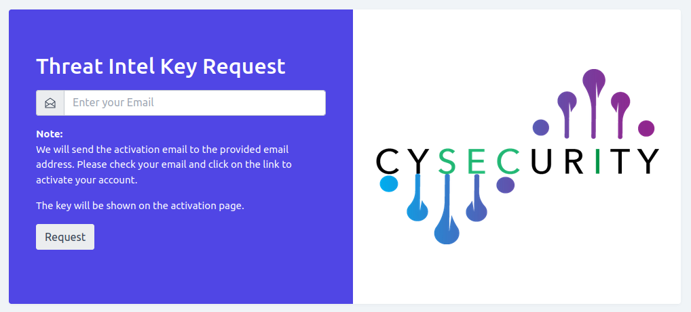

- Then you will get the activation link over email.

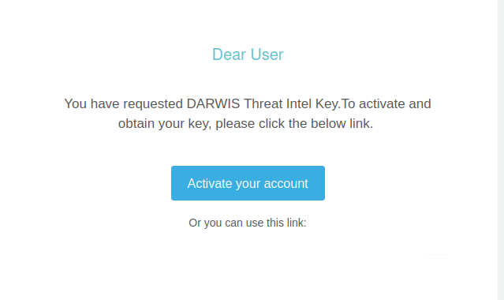

- Once you click on `Activate your account`, you can view the License key on the `success` page.

> **Note:If you are using both dianeoa and darwis tpot. You need to use a different email id to request the key. **

### Accessing the Panel

On your desktop, open a browser (Firefox or Chrome, recommended: Firefox) and enter the following address: https://localhost:64443

- You will get a self-signed certificate error message.  Click the `Advanced` button and then click the `Accept the Risk and Continue` button.

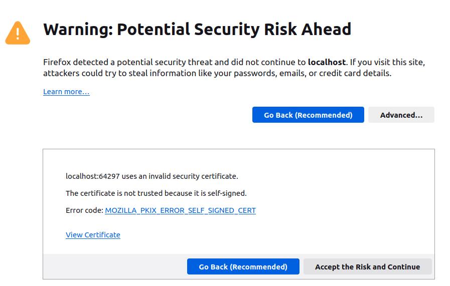

- This will take you to the setup page. Click the `Setup` button, which will perform the base setup for the panel. If successful, it will take you to the license activation page.

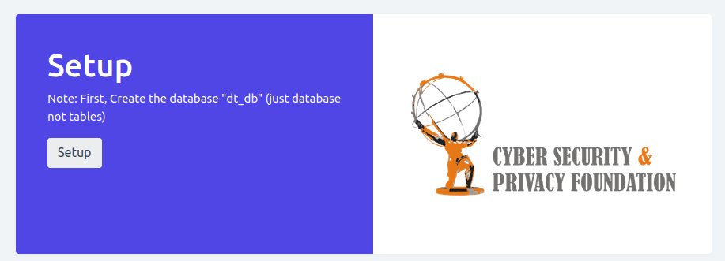

- On the activation page enter the license key you received.

### User Creation & Login

Once the license key is successfully validated, the panel will display the user creation page. Fill the form with username, password, and email.

**Note: The email address is just for user creation. It is not used or uploaded to any external server.**

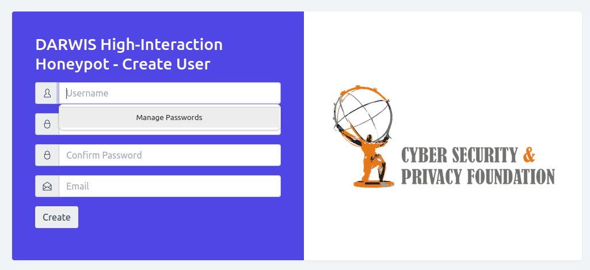
 
Once the account is created, you will be redirected to the login page. Enter your username and password to log in,

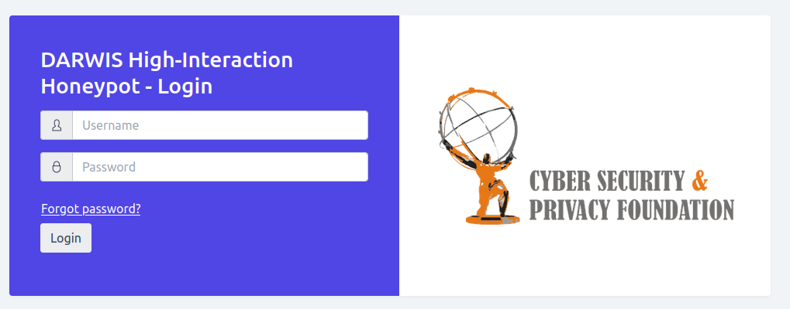

Once you log in, the Honeypot panel can be viewed.

### Honeypot Panel

The Honeypot analyzes incidents with our threat intel and categorizes each incident into the following types:

- Whitelist: Trusted and safe samples.
- Safe/Clean: The sample is found to be safe at the moment.
- Malicious: Known threat samples.
- New Malware: Represents threats that have not been previously identified but are detected now.

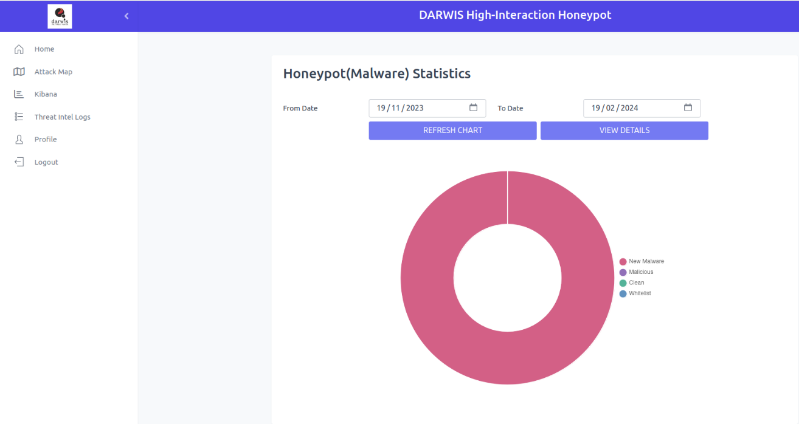

You can filter the statistics by choosing From date and To date, then click on the `Refresh Chart` option to see details in different date ranges.

### Honeypot: View details/ View logs

By clicking the `View Details` button on the home page, you can see the honeypot logs including Incident ID, Incident Time, SHA256, and Verdict.

You can filter the logs by choosing the verdict from the Search by Verdict list menu, then click on Filter to show the entries.

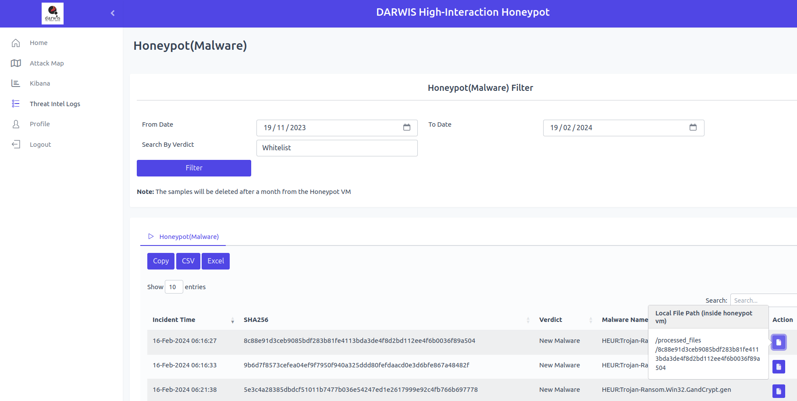

- You can copy the logs, and download the logs in CSV format and Excel format.
- By clicking the icon under the Action menu, you can view the directory path where the malware sample is located.

### Profile  

You can view your profile information, which includes name, username, and email address.

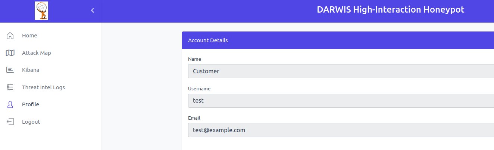

### Logout

You can click on the `logout` option to logout from the panel. 

## Accessing the T-Pot Panel

On your desktop, open a browser (Firefox or Chrome, recommended: Firefox) and enter the following address: https://localhost:64297.

- You will get a self-signed certificate error message.  Click the `Advanced` button and then click the `Accept the Risk and Continue` button.

- This will prompt you to the sign-in page.

Please enter the `username` and `password` from the `IMPORTANTCREDENTIALSANDURLDETAILS.txt` file into the prompt and click on the `sign-in`.

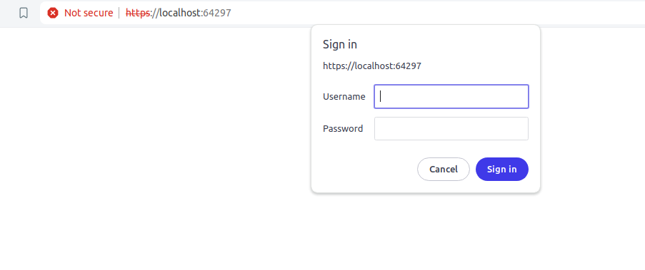

- Once you log in, the T-Pot Home page will be displayed.

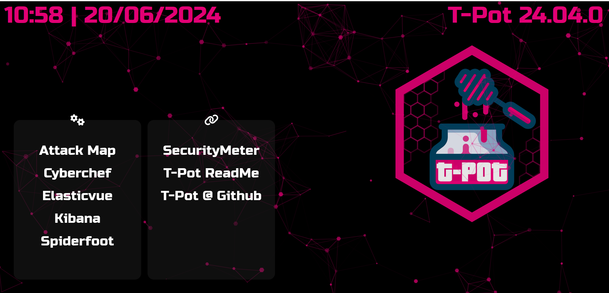

## Accessing the Kibana Dashboard

Kibana works with Elasticsearch for visualizing and exploring data. It includes helpful visualizations designed to identify potentially malicious attacks to help investigate further.

To view the Kibana dashboard, click `Kibana` in the side menu of the T-Pot Panel or the Threat-Intel dashboard. Then, you can see the dashboard as shown below.

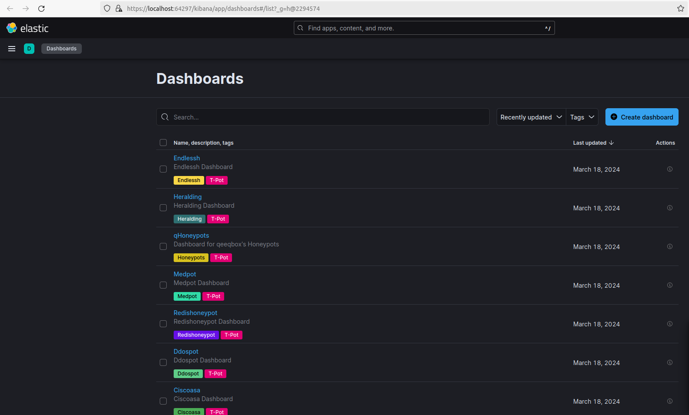

## Steps to import custom dashboard

To create a custom dashboard, go to https://localhost:64297/kibana/app/management/kibana/objects to view the `Saved Objects` dashboard, or navigate through the `side menu (hamburger menu)`, scroll down to `Stack Management` under `Management`, and click on `Saved Objects` under `Kibana`.

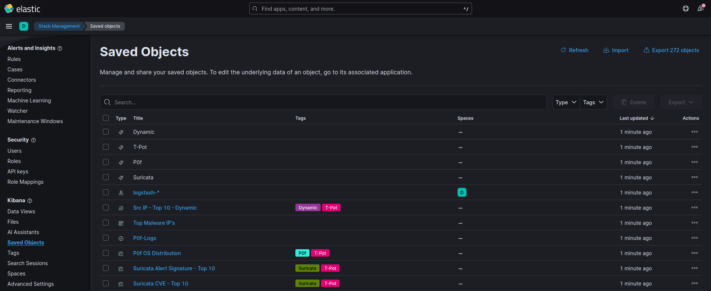

Click on `Import` in the top-right corner. Under Select a file to import, choose `Import`. Browse for the `importme.ndjson` file in the `custom_dashboard` folder within the project directory and click `Open`. Keep the `default import options` and click `Import`.

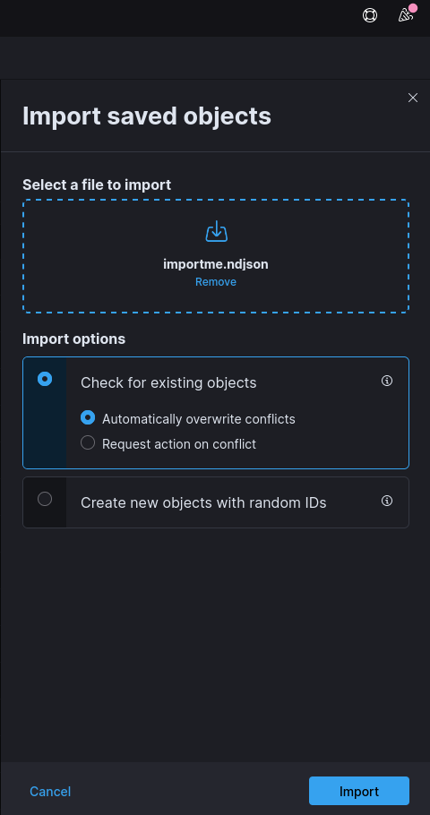

Once the file is imported, navigate to the side menu, and click on `Dashboards` under `Analytics` to view the imported custom dashboard as shown below.

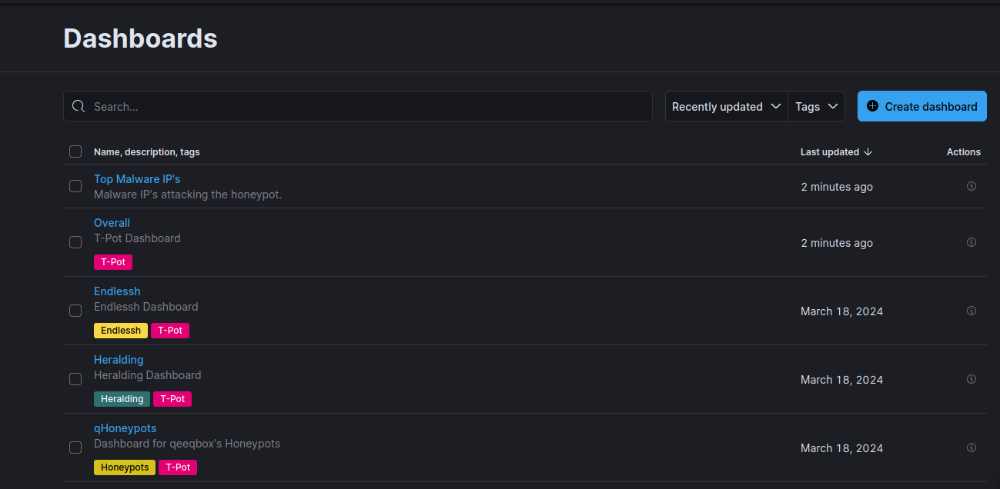

Hover over the honeypot name and click to view the corresponding dashboard.

### Top Malware IP's Dashboard

This dashboard will display the top Malware IPs attacking the honeypot.

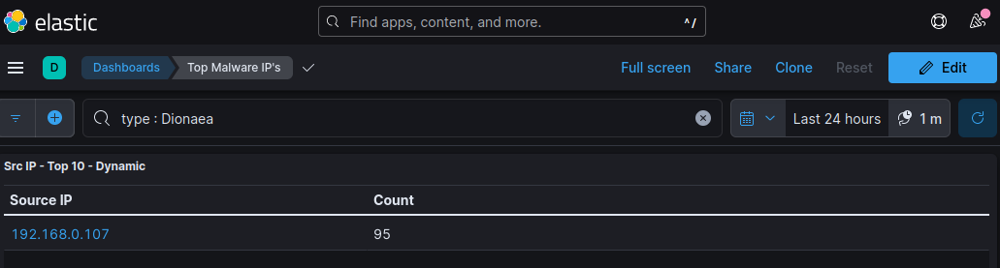

### Overall Dashboard

This dashboard will display an overall attack summary of the top 10 honeypots.

#### HoneyPot Attacks - Top 10

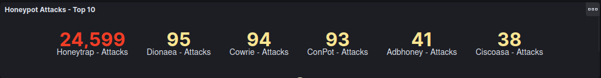

Displays the number of attacks and unique source IPs that occurred over time in all the top honeypots.

#### HoneyPot Attacks Bar

This bar chart represents the count of attacks and unique source IPs detected over attacks.

#### Top 10 Ports

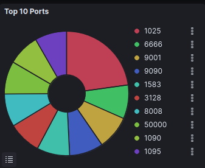

This pie chart shows the number of attacks per port of the top honeypots.

#### Attack Map -Dynamic

This bubble chart illustrates the geographic view of the source of attacks. By changing the latitude and longitude in the filter option, you can view the results accordingly.

#### Attacks by Destination Port Histogram

This graphical representation provides a dynamic view of targeted ports over time, displayed through a histogram.

#### Honeypot Attacks Histogram

This histogram graph illustrates the number of attacks and unique source IPs over time of all the honeypots.

#### Attacks by Honeypot

This pie chart illustrates the number of attacks per honeypot.

#### P0f OS Distribution

This pie chart illustrates the OS detection of the attacker system.

#### Suricata Alert Category Histogram

This graphical representation illustrates the different types of alerts triggered by attackers.

#### Username Tagcloud

Displays the attacker’s usernames, which they used during the attack. If you want to filter a specific username, click on the particular name and it will show the corresponding results of the attackers.

#### Password Tagcloud

Display the captured passwords that attackers used during the attack. You can filter a password by clicking on it, and it will show the corresponding results along with its username in the username tagcloud section.

#### Suricata CVE - Top 10

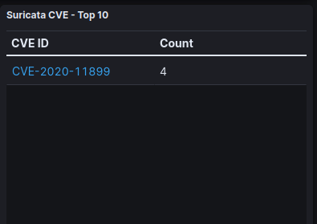

Lists the top 10 CVE numbers for the attacks that triggered.

#### Suricata Alert Signature

Based on the alert signature, Suricata lists the signature ID, corresponding signature name, and total number of attacks triggered by attackers.

## Attack Map

In the Attack Map, the graphical interface dynamically shows the honeypot events in real time. It presents statistics categorized by source IP, country, and services, with colors indicating different services. It displays the hit counts for source IP and country in descending order.

Click on `Attack Map` from the side menu in the threat-Intel dashboard to view the attack map.

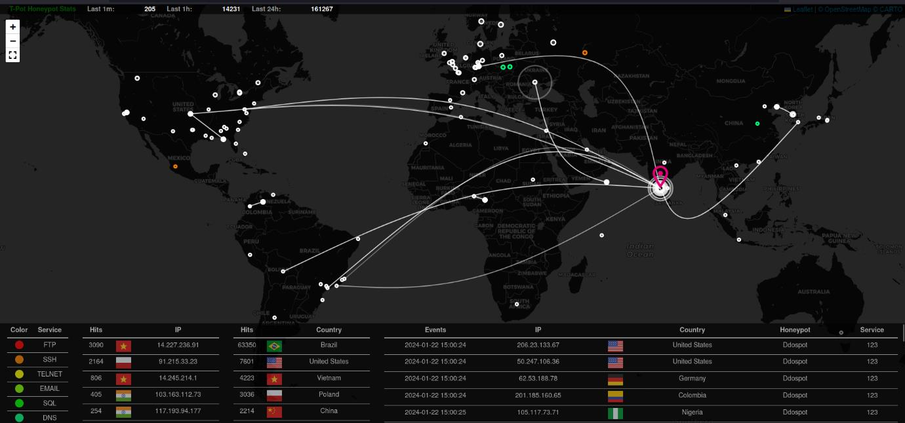

